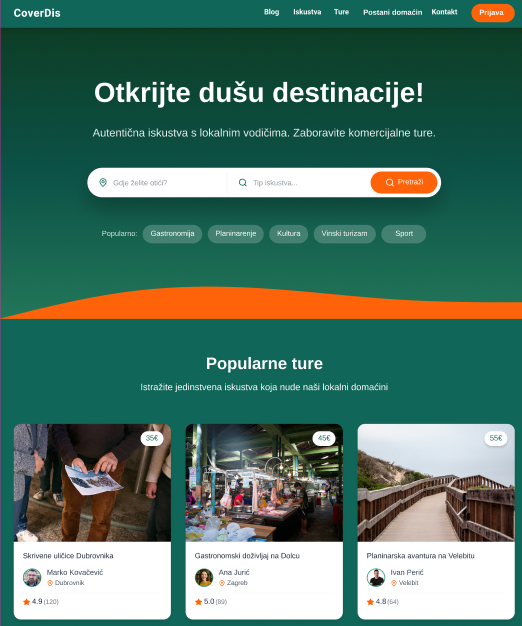
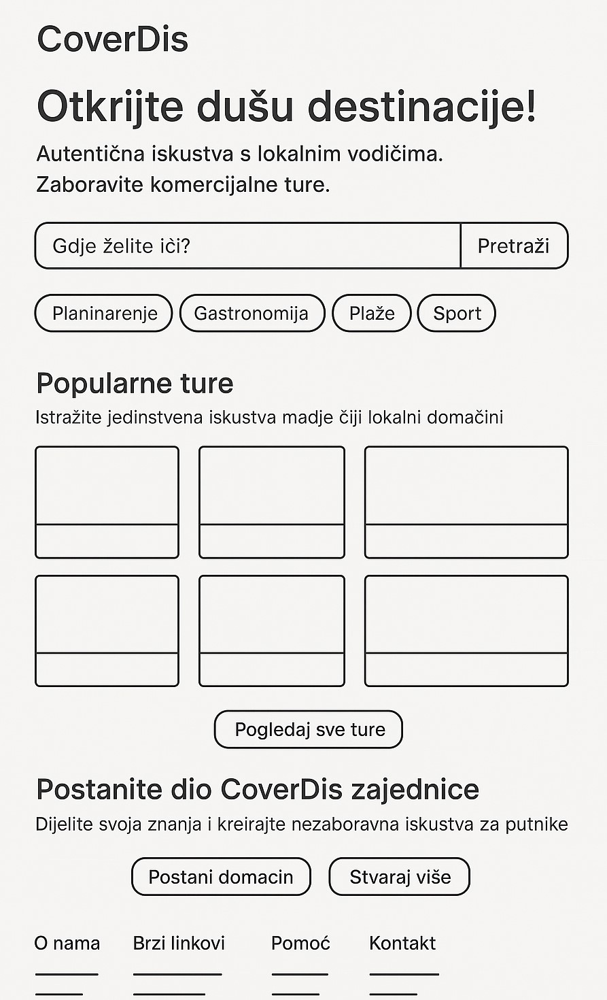

# Low and High Fidelity Prototype

### Opis

U ovom zadatku koristili smo prijašnje zadatke kao referencu, uz male promjene (npr. nazivi u nav-baru, postani domaćin zvuči puno bolje od dodaj turu). Dizajnirali smo uz pomoć Figme landing page sa nav-barom, pretraživačem tura, preporučenim turama, te footerom sa podacima. Koristili smo vodiča čiju smo personu napravili u prošlom zadataku, te dodali još drugih vodiča i njihovih tura.

### Link na High fidelity prototype

(https://www.figma.com/proto/V3irlLnzWyNrwLSnxiz3OT/Untitled?node-id=1-2&p=f&t=QkWwuZ4ngYrk3Q5A-0&scaling=min-zoom&content-scaling=fixed&page-id=0%3A1)

### High-fidelity prototip

### Low-fidelity prototip

